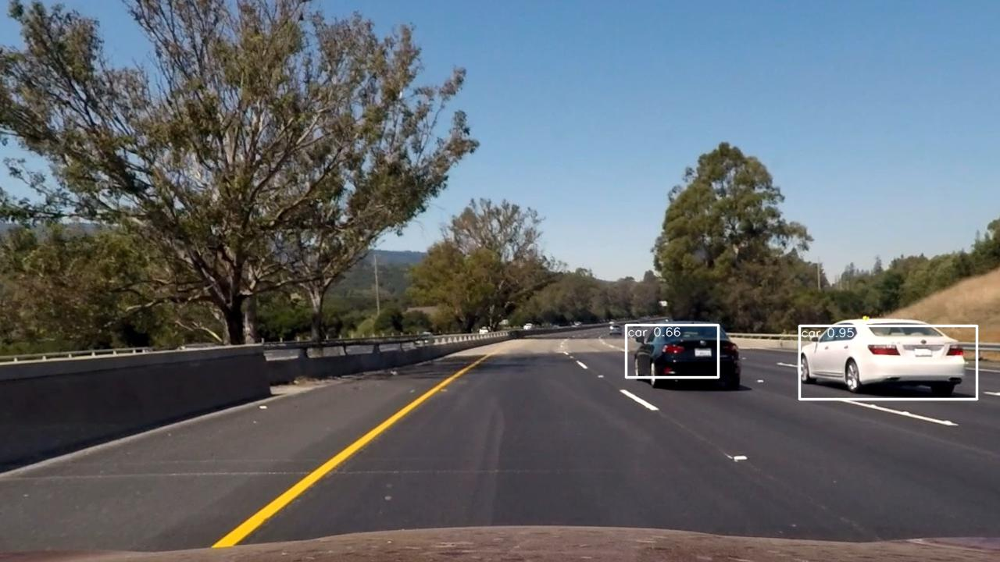

## Lane Line &#x1F6E3; & Vehicle &#x1F697; Detector

*All instructions and comments related to lane line detection will be indicated with the &#x1F6E3; symbol.*

*All instructions and comments related to vehicle detection will be indicated with the &#x1F697; symbol.*

### Project Description
---

**The goals of this project are the following:**

- &#x1F6E3; Detect lane lines using an OpenCV-based algorithm
- &#x1F697; Detect vehicles on the road using a deep machine learning algorithm

**The steps of this implementation are as following:**

- Compute the camera calibration matrix and distortion coefficients given a set of chessboard images.
- &#x1F697; Create Keras implementation of [YOLO9000](https://pjreddie.com/darknet/yolo/) Tiny YOLO model.
- &#x1F697; Load pre-computed weights for the VOC dataset.
- Get raw images or from frames of video passed on the command line.
- Apply a distortion correction to raw images.
- &#x1F6E3; Apply a perspective transform to rectify binary image ("birds-eye view").
- &#x1F6E3; Use color transforms, gradients, etc., to create a thresholded binary image.
- &#x1F6E3; Detect lane pixels and fit to find the lane boundary.
- &#x1F6E3; Determine the curvature of the lane and vehicle position with respect to center.
- &#x1F6E3; Warp the detected lane boundaries back onto the original image.
- &#x1F6E3; Output visual display of the lane boundaries and numerical estimation of lane curvature and vehicle position.
- &#x1F697; Run image through Tiny Yolo model and return predictions.
- &#x1F697; Take predictions and turn them into bounding boxes using confidence thresholds.
- &#x1F697; Output visual display of bounding boxes onto original image.

### Files & Running the Code
---
**The project includes the following files:**

- [camera_calibrator.py](camera_calibrator.py) module/program to calibrate and transform images between camera and real world
- [camera_cal.npz](camera_cal.npz) saved camera distortion coefficients
- [camera_cal/](camera_cal) directory of checkerboard images taken with camera
- [debug.py](debug.py) common debug module
- &#x1F6E3; [sobel_tuner.ipynb](sobel_tuner.ipynb) interactive Sobel thresholding parameter tuner
- &#x1F6E3; [lane_lines.py](lane_lines.py) lane line detection module/program
- [test_images/](test_images) sample input images
- [project_video.mp4](project_video.mp4) sample input video (*signoff criteria*)
- [challenge_video.mp4](challenge_video.mp4) challenging input video
- [harder_challenge_video.mp4](harder_challenge_video.mp4) very challenging input video
- &#x1F6E3; [output_images/](output_images) output images and videos after running through lane line detection algorithm
- &#x1F697; [vehicle_detector.py](vehicle_detector.py) vehicle detection module/program
- &#x1F697; [yolo_keras.py](yolo_keras.py) Keras implementation of Tiny YOLO
- &#x1F697; [output_images/vd/](output_images/vd) output images and videos after running through vehicle detection algorithm

**To run the code, the following resources are needed:**

- a full Python 3.x, OpenCV 3.x environment
	- if using conda, run `conda env create -f conda-env.yml`
	- here are environment files for [macOS](conda-macos.yml) and [AWS Ubuntu 16.04 p2.xlarge AMI](conda-aws-p2.yml)

**To calibrate the camera:**

- if using conda environment above, run `source activate highgain`
- run the calibrator as follows:
```sh
python camera_calibrator.py [--caldir DIRECTORY] [--npz FILENAME] [--width WIDTH] [--height HEIGHT] [--display]

  --caldir DIRECTORY  directory containing chessboard calibration images (DEFAULT: camera_cal)
  --npz FILENAME      filename to save camera calibration matrix and distortion coefficients (DEFAULT: camera_cal.npz)
  --width WIDTH       width of camera in pixels (DEFAULT: 1280)
  --height HEIGHT     height of camera in pixels (DEFAULT: 720)
  --display           display test images
```

**&#x1F6E3; To run the lane line detection program:**

- if using the conda environment above, run `source activate highgain`
- run the lane line detector on one or more images or videos as follows (e.g. INFILE can be `project_video.mp4` and OUTDIR can be `output_images`)
```sh
python lane_lines.py [--cal FILENAME] [--display] [--outdir OUTDIR] INFILE [INFILE ...]

  INFILE           input filenames - either .jpg or .mp4 format
  --cal FILENAME   filename with camera calibration matrix & distortion coefficients (DEFAULT: camera_cal.npz)
  --display        display augmented images/video
  --outdir OUTDIR  output directory (DEFAULT: ".")
```

**&#x1F697; To setup for the vehicle detection program:**

Setup Darknet as follows...
```sh
git clone https://github.com/pjreddie/darknet
cd darknet
# edit Makefile if using GPU, CUDNN, etc.
make
wget https://pjreddie.com/media/files/tiny-yolo-voc.weights
cp -p cfg/voc.data cfg/voc.data.backup; sed -e 's/data/darknet\/data/' cfg/voc.data.backup > cfg/voc.data
```

Setup YAD2K as follows...
- if using the conda environment above, run `source activate highgain`
```sh
git clone https://github.com/allanzelener/yad2k.git
cd yad2k
python yad2k.py ../darknet/cfg/tiny-yolo-voc.cfg ../darknet/tiny-yolo-voc.weights model_data/tiny-yolo-voc.h5
```

**&#x1F697; To run the vehicle detection program:**

- if using the conda environment above, run `source activate highgain`
- run the vehicle detector on one or more images or videos as follows (e.g. INFILE can be `project_video.mp4` and OUTDIR can be `output_images/vd`)
```sh
python vehicle_detector.py [--cal FILENAME] [--display] [--outdir OUTDIR] INFILE [INFILE ...]

  INFILE           input filenames - either .jpg or .mp4 format
  --cal FILENAME   filename with camera calibration matrix & distortion coefficients (DEFAULT: camera_cal.npz)
  --display        display augmented images/video
  --outdir OUTDIR  output directory (DEFAULT: ".")
```

### Camera Calibration
---

The camera calibration module [camera_calibrator.py](camera_calibrator.py) has many helper functions that can be used to get data to map from what the camera sees to the real world (and vice versa in some cases). Currently, this includes:
    1. finding camera distortion effects, calculating distortion coefficients to undistort the image, and loading/saving/using those coefficients
    2. calculating transforms to convert between forward and birds-eye top-down views (*currently hardcoded*)
    3. calculating pixel to real world resolutions to enable distance calcluations (*currently hardcoded*)
    
For #1 above, the algorithm is to use multiple checkerboard images and find the corners in both image space and expected 2D space. Using those differences, OpenCV has simple functions to calculate the distortion coefficients. The images below show the detected corners and a sample undistorted image.

 

For #2 & #3, they are hardcoded based on data measured from sample images. In future work, this can be automated by getting data from known calibration test images.

### &#x1F6E3; Lane Line Detection Pipeline
---

The lane line detection module [lane_lines.py](lane_lines.py) consists of the following steps:

- load the camera distortion coefficients
- correct for camera distortion in images or incoming video frames
- transform perspective from forward camera view to top-down/birdseye view
- use color thresholds to find yellow and white lane lines
- optionally, use Sobel gradient thresholds to find lane lines (*this is disabled right now due to excessive noise introduced by the algorithm*)
- combine the thresholded images to create a single binary threshold image with lane pixels
- detect lane pixels (red for left/blue for right) and find left and right polynomials that fit the majority of those lane pixels
- determine curvature of the lane and how far offset from center the vehicle/camera is
- draw lane data and curvature/offset onto picture
- transform perspective back from birdseye view to forward view
- output the image or video

For this test image and output, the intermediate pipeline images, with some debug information, is shown below.

 


Here is the output of [lane_lines.py](lane_lines.py) on the sample video. Click on the previews to see the full video.
<a href="project_video.mp4"></a> <a href="output_images/project_video.mp4"></a>

### &#x1F697; Vehicle Detection Pipeline
---

The vehicle detection module [vehicle_detector.py](vehicle_detector.py) consists of the following steps:

- load the camera distortion coefficients
- correct for camera distortion in images or incoming video frames
- resize image to fit Tiny Yolo model for VOC datasets
- run image through Tiny Yolo model and return predictions
- convert predictions into bounding boxes using confidence thresholds
- overlay visual display of bounding boxes onto original image
- output the image or video

A test image and output are shown below.

 

Here is the output of [vehicle_detector.py](vehicle_detector.py) on the challenge video. Click on the previews to see the full video.
<a href="challenge_video.mp4"></a> <a href="output_images/vd/challenge_video.mp4"></a>

### Issues & Future Work
---

Though this pipeline works well for the test images and the first sample video, it is not robust. Here are some issues that will need to be addressed. A lot of these are listed in the TODO comments in the code.

- **The lane line detection and vehicle detection code are currently in separate modules/executables and need to be combined into one with both overlays.**
- Once the detectors are combined, the next step would be to multithread the two detectors to increases performance.
- &#x1F6E3; The birdseye and distance transforms are currently hardcoded. In a proper implementation, this could be dynamic using calibration images, ala the checkerboards for the distortion.
- &#x1F6E3; Color thresholding works well on its own, but will likely fail in poor lighting conditions or when there are white or yellow like colors nearby (e.g., the wheatish grass in the [harder challenge video](harder_challenge_video.mp4)). This will need to be supplemented with something else like Sobel gradient thresholding.
- &#x1F6E3; Sobel gradient thresholding does not work well due to lots of "noise". This may be tuned (see [sobel_tuner.ipynb](sobel_tuner.ipynb)) to work better, but the likely issue is that there will always be too much spurious data that needs to be filtered either before or after the gradient thresholding. I've attempted to do so using some morphology operations (erosion and tophat) but further work is needed here.
- &#x1F6E3; Currently, we speed up the algorithm by searching for lane line pixels only around the previous frame's lane lines if we have found valid lines. This works well for most situations except when there is a sudden change in lane direction which can happen from time to time. The solution to this would be also re-search the entire image for the new lane lines and then do a probabilistic guess on which search is more accurate. However, this increases computation time quite a bit.
- &#x1F6E3; Once the lane line pixels are found, the current algorithm uses a simple 2nd order polynomial fit to determine lane lines. A more robust implementation would be to use the RANSAC (RANdom SAmple Consensus) algorithm to do spline fitting. This would be much better at ignoring outliers and only considering high probability pixels.
- &#x1F6E3; The current algorithm filters out bad lane fits if one side of the lane diverges from the other by too much. This effectively throws out lane merges and exits and continues on the current trajectory which is usually safe but not necessarily optimal. Future work will have to gracefully handle this.
- &#x1F6E3; The current algorithm averages across the last 5 frames equally to smooth out the path. We may want to do a weighted average across more frames, favoring more recent lane data.
- &#x1F6E3; The interactive iPython tuner for Sobel threshold parameters is quite useful but limited and cumbersome. In the future, we could implement a Tkinter-based GUI to tune those and many other parameters and show the results real-time.
- &#x1F6E3; Overall, the OpenCV based implementation will have lots of limits as new scenarios are found. A much better approach would be to create a deep learning neural network to handle these and new situations.
- &#x1F697; The speed is still very slow, in seconds/iteration on a CPU, even though this is just inference. This should be much faster.
- &#x1F697; There are still some false positives, for example, the occasional traffic billboard. This should be reduceable by taking the existing weights but optimizing based on the [Udacity datasets](https://github.com/udacity/self-driving-car/tree/master/annotations).
